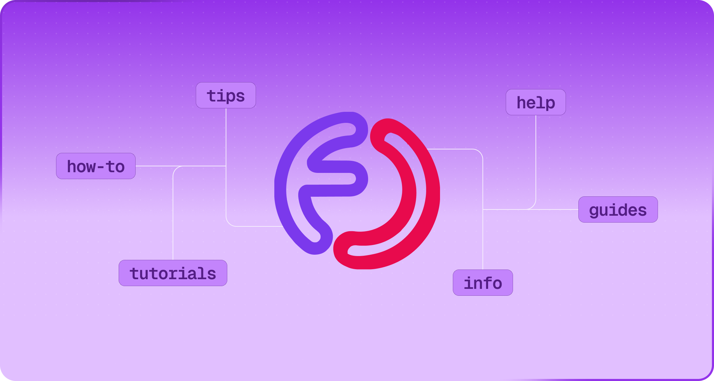
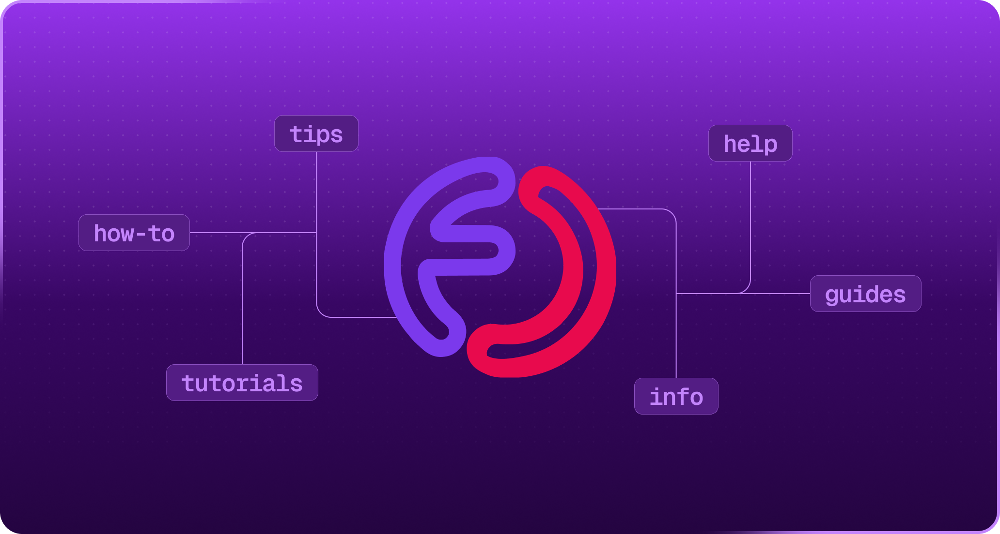

## QuickStart

Choose a section to jump into or select an article from the side menu

<CardGroup cols={2}>
  <Card title="Get Started" icon="rocket" iconType="duotone" color="#9333ea" href="https://faucetcrypto.mintlify.app/get-started/">
    Introductory guides to set up and begin your journey with Faucet Crypto
  </Card>
  <Card title="Earning & Leveling" icon="trophy" iconType="duotone" color="#9333ea" href="https://faucetcrypto.mintlify.app/earning-and-leveling/">
    Uncover strategies to level up faster and maximize your earnings
  </Card>
  <Card title="Items & Market" icon="gem" iconType="duotone" color="#9333ea" href="https://faucetcrypto.mintlify.app/items-and-market/">
    Explore the power of Items and how to trade them for coins
  </Card>
  <Card title="Withdrawals" icon="money-bill-transfer" iconType="duotone" color="#9333ea" href="https://faucetcrypto.mintlify.app/withdrawals/">
    Everything you need to know about withdrawing your earnings
  </Card>
  <Card title="Account & Security" icon="shield-quartered" iconType="duotone" color="#9333ea" href="https://faucetcrypto.mintlify.app/account-and-security/">
    Essential profile management and security tips to safeguard your account
  </Card>
  <Card title="Tutorials" icon="square-question" iconType="duotone" color="#9333ea" href="https://faucetcrypto.mintlify.app/tutorials/">
    Visual walkthroughs and practical solutions for uncommon issues
  </Card>
</CardGroup>